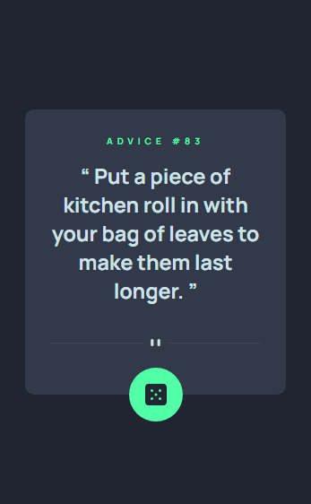
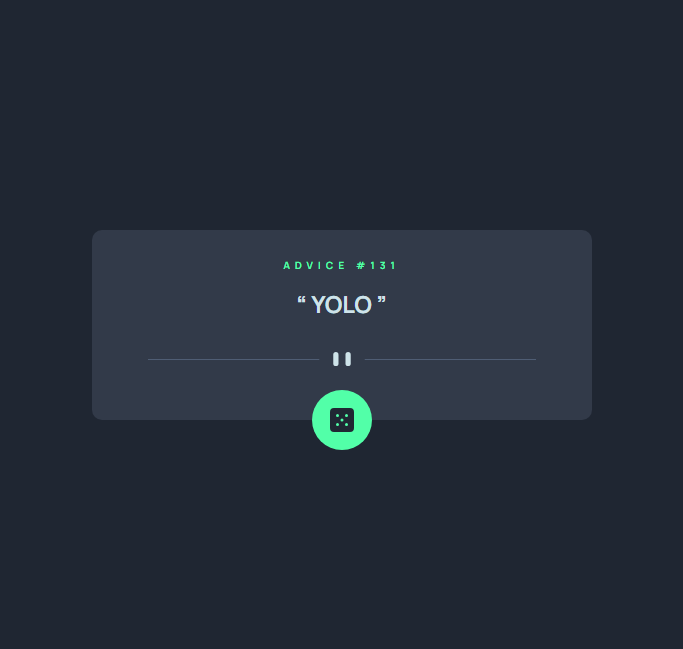

# Frontend Mentor - Advice Generator App Solution

This is my solution to the Frontend Mentor Advice Generator App challenge, focusing on creating an interactive advice display interface.

## Table of contents

- [Overview](#overview)
  - [The challenge](#the-challenge)
  - [Screenshot](#screenshot)
  - [Links](#links)
- [My process](#my-process)
  - [Built with](#built-with)
  - [Key Features](#key-features)
  - [Development Highlights](#development-highlights)
  - [Useful resources](#useful-resources)
- [Author](#author)

## Overview

### The challenge

Built a fully interactive advice generator with:

✅ Random advice generation
✅ Interactive dice button
✅ Responsive design
✅ Hover states
✅ Screen size optimization

### Screenshot

### Links

- Live Site: https://wisdomroll.netlify.app/
- Repository: https://github.com/Mutairu-Lawal/fe-ch-advice-generator-app

## My process

### Built with

- HTML5 semantic markup
- CSS custom properties
- Flexbox & Grid
- JavaScript for API integration
- Mobile-first workflow

### Key Features

- Random advice generation via API
- Interactive dice button
- Responsive layout
- Hover state animations
- Mobile-optimized design
- Scss/Sass for styling

### Development Highlights

- Implemented API integration for advice generation
- Created responsive layout using CSS Grid/Flexbox
- Added interactive states and animations
- Ensured mobile-first responsive design
- Optimized for various screen sizes

### Useful resources

- [Advice Slip API](https://api.adviceslip.com) - The API used for generating random advices

## Author

- Website - [Mutairu Lawal](https://mutairu-lawal.netlify.app/)
- Frontend Mentor - [Mutairu-Lawal](https://www.frontendmentor.io/profile/Mutairu-Lawal)
- Twitter - [@Amdrealmtlaw](https://twitter.com/Amdrealmtlaw)
